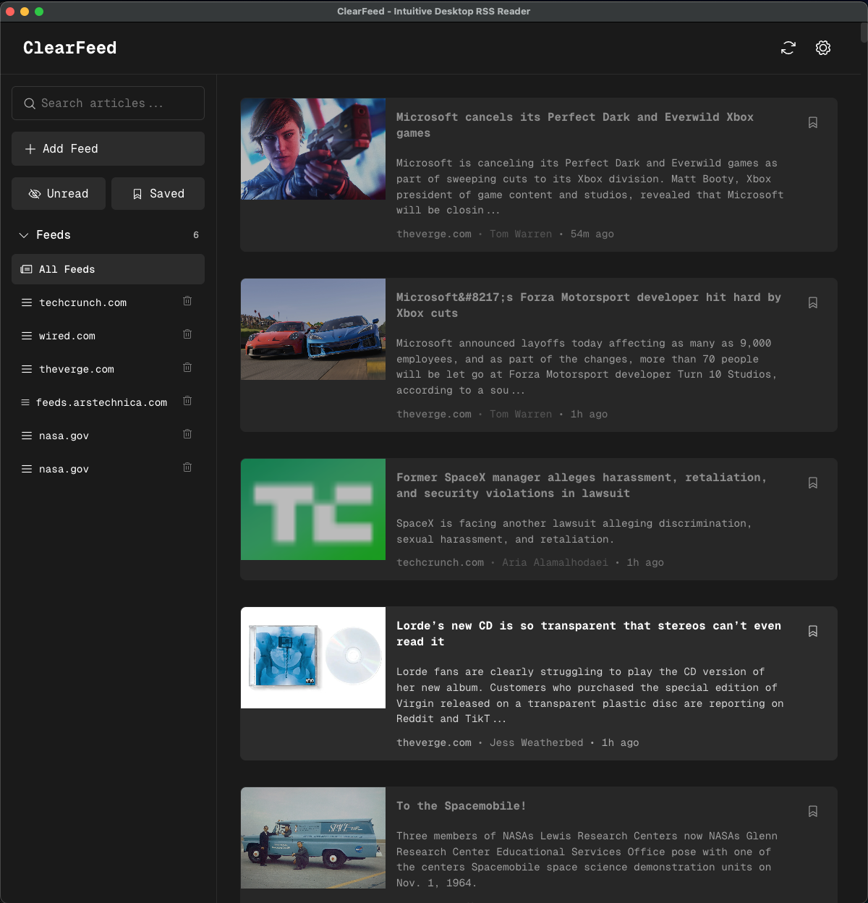
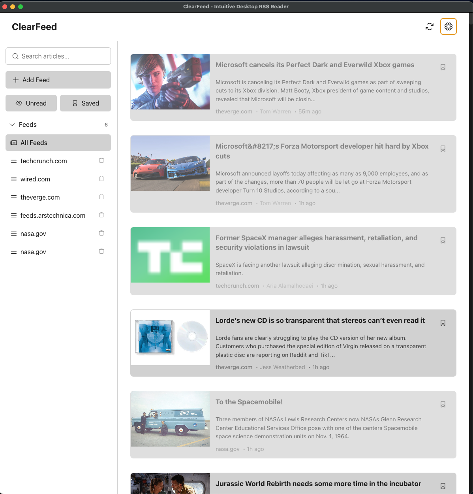

<div align="center">
  
  
  # ClearFeed RSS Reader

  <p><strong>Made by <a href="https://creationbase.io">Creationbase</a></strong></p>

[](https://opensource.org/licenses/MIT)
[](https://github.com/forresttindall/ClearFeed-RSS-Reader/releases)
[](https://github.com/forresttindall/ClearFeed-RSS-Reader/releases)
[](https://github.com/forresttindall/ClearFeed-RSS-Reader/stargazers)
[](https://github.com/forresttindall/ClearFeed-RSS-Reader/network)

</div>


A free and open-source minimalist RSS feed reader desktop application for Linux, macOS, and Windows. Completely private with no algorithms, built in ad blocker, and popup blocker, no tracking, and fully offline capable.


## Screenshots

### Dark Mode


### Light Mode


## Features

- Fast and responsive desktop interface
- Dark/Light theme support
- Mono/Sans font options
- Mobile-friendly design
- Full-text search across all articles
- Save articles for later reading
- Track read/unread status
- Completely private - no data leaves your device
- No algorithms, ads, or tracking
- Fully offline capable
- Complete data control
- Clean, minimalist interface
- Cross-platform support (Linux, macOS, Windows)

## Download and Installation

### System Requirements

- **Windows**: Windows 10 or later
- **macOS**: macOS 10.14 (Mojave) or later
- **Linux**: Most modern distributions with glibc 2.17+

### Installation Files

Download the appropriate installer for your operating system from the [Releases](https://github.com/forresttindall/ClearFeed-RSS-Reader/releases) page:

#### Windows
- **ClearFeed-Setup-0.1.1.exe** - Windows installer (recommended)
- **ClearFeed-0.1.1-win.zip** - Portable Windows version

#### macOS
- **ClearFeed-0.1.0.dmg** - macOS disk image for Intel Macs
- **ClearFeed-0.1.0-arm64.dmg** - macOS disk image for Apple Silicon Macs (M1/M2)
- **ClearFeed-0.1.0-mac.zip** - Portable macOS version for Intel Macs
- **ClearFeed-0.1.0-arm64-mac.zip** - Portable macOS version for Apple Silicon Macs

#### Linux
- **ClearFeed-0.1.0.AppImage** - Universal Linux application (recommended)
- **ClearFeed-0.1.0-arm64.AppImage** - ARM64 Linux application
- **ClearFeed-0.1.0.tar.gz** - Portable Linux version (x64)
- **ClearFeed-0.1.0-arm64.tar.gz** - Portable Linux version (ARM64)

### Installation Instructions

#### Windows
1. Download **ClearFeed-Setup-0.1.1.exe**
2. Run the installer and follow the setup wizard
3. Launch ClearFeed from the Start Menu or Desktop shortcut

#### macOS
1. Download the appropriate .dmg file for your Mac:
   - Intel Macs: **ClearFeed-0.1.0.dmg**
   - Apple Silicon Macs: **ClearFeed-0.1.0-arm64.dmg**
2. Open the downloaded .dmg file
3. Drag ClearFeed to your Applications folder
4. Launch ClearFeed from Applications

**Note**: On first launch, you may need to right-click the app and select "Open" to bypass macOS security restrictions.

#### Linux

**AppImage (Recommended)**
1. Download the appropriate AppImage for your architecture:
   - x64: **ClearFeed-0.1.0.AppImage**
   - ARM64: **ClearFeed-0.1.0-arm64.AppImage**
2. Make it executable: `chmod +x ClearFeed-0.1.0*.AppImage`
3. Run the application: `./ClearFeed-0.1.0*.AppImage`

**Portable Version**
1. Download the appropriate tar.gz for your architecture:
   - x64: **ClearFeed-0.1.0.tar.gz**
   - ARM64: **ClearFeed-0.1.0-arm64.tar.gz**
2. Extract: `tar -xzf ClearFeed-0.1.0*.tar.gz`
3. Run the application from the extracted directory

## Getting Started

1. **Add RSS Feeds**: Click the "Add Feed" button and enter the RSS feed URL
2. **Browse Articles**: Select a feed from the sidebar to view its articles
3. **Read Articles**: Click on any article to open it in the built-in reader
4. **Search**: Use the search functionality to find specific articles across all feeds
5. **Customize**: Toggle between dark/light themes and mono/sans fonts in settings
6. **Manage**: Mark articles as read/unread and save articles for later reading


## FAQ 

**Why are there not photos in some feeds?**: Some RSS feed do not contain preview images! 

**Are More Features Coming Soon?**: Yes! I am working on adding more features to ClearFeed. Some of the features we are working on include:
- Feed Categorization
- Feed Organization
- Feed Customization
- Feed Filtering
- Feed Sorting
- Sharing

**What are some good RSS feeds?**: https://www.404media.co/rss, https://www.theverge.com/rss/partner/subscriber-only-full-feed/rss.xml, https://www.nasa.gov/feeds/iotd-feed/, https://www.nasa.gov/news-release/feed/, https://www.nasa.gov/technology/feed/, https://feeds.bbci.co.uk/news/world/rss.xml, https://feeds.npr.org/1004/rss.xml, https://techcrunch.com/feed/, https://www.bloomberg.com/feed, https://finance.yahoo.com/news/rss-feeds, http://feeds.arstechnica.com/arstechnica/index, https://www.wired.com/feed/rss, https://www.wired.com/feed/tag/ai/latest/rss, https://cointelegraph.com/rss, https://coinjournal.net/news/feed/, https://feeds.feedburner.com/TheHackersNews?format=xml.


## Tech Stack

- **Frontend**: React
- **Backend**: Node.js with Express
- **Database**: SQLite
- **RSS Parser**: rss-parser
- **Desktop Framework**: Electron

## Development

### Prerequisites
- Node.js (v14 or higher)
- npm or yarn

### Building from Source

1. Clone the repository:
   ```bash
   git clone https://github.com/forresttindall/ClearFeed-RSS-Reader.git
   cd ClearFeed-RSS-Reader
   ```

2. Install dependencies:
   ```bash
   # Install main dependencies
   npm install
   
   # Install frontend dependencies
   cd frontend
   npm install
   cd ..
   ```

3. Build the frontend:
   ```bash
   cd frontend
   npm run build
   cd ..
   ```

4. Start the application:
   ```bash
   npm start
   ```

### Development Mode

To run in development mode with hot reloading:

```bash
npm run dev
```

This will start both the frontend development server and the Electron application.

### Building Distribution Files

To create distribution files for all platforms:

```bash
npm run dist
```

This will generate installers and portable versions for Windows, macOS, and Linux in the `dist/` directory.

## Contributing

Contributions are welcome! Please feel free to submit a Pull Request.

1. Fork the repository
2. Create your feature branch (`git checkout -b feature/AmazingFeature`)
3. Commit your changes (`git commit -m 'Add some AmazingFeature'`)
4. Push to the branch (`git push origin feature/AmazingFeature`)
5. Open a Pull Request

## License

This project is licensed under the MIT License - see the [LICENSE](LICENSE) file for details.

## Support

If you find ClearFeed useful, consider supporting its development:

- Star the repository
- Share with others
- Report bugs and suggest features
- Contribute to the codebase
- Buy me a coffee https://buymeacoffee.com/forresttindall

## Contact

Forrest Tindall - Forrest.tindall@gmail.com

Project Link: [https://github.com/forresttindall/ClearFeed-RSS-Reader](https://github.com/forresttindall/ClearFeed-RSS-Reader)

## Acknowledgments

- Built with React
- Icons by Phosphor Icons
- Font by Geist
- Powered by Electron